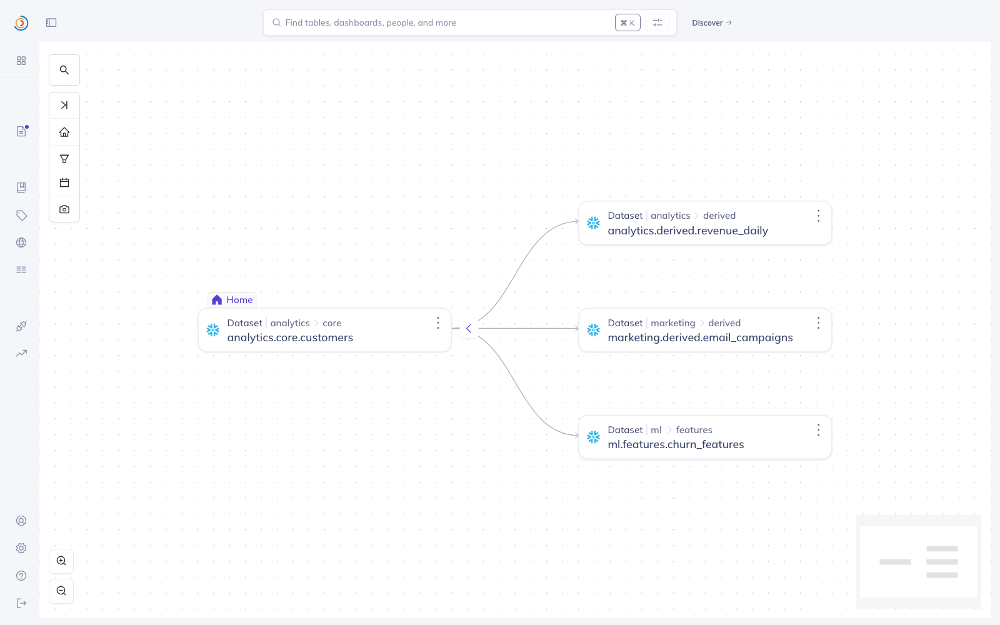

# LineageGuard

**A metadata-aware SQL change reviewer. It reads your DataHub graph, walks the real downstream blast radius of a proposed change, and has an AI agent write a risk-scored review — grounded in actual lineage, ownership, and PII tags, not guesses.**

Built for the **Build with DataHub: The Agent Hackathon**.

---



*The live DataHub lineage LineageGuard reads: `analytics.core.customers` fanning out to three downstream datasets. A proposed `DROP COLUMN` on the source is the change LineageGuard reviews — see the generated PR comment in [`examples/sample_review.md`](examples/sample_review.md).*

## The problem

A data engineer opens a PR that drops a column or replaces a view. The reviewer has no way to know, at review time, what that change actually breaks: which dashboards go blank, which ML models lose a feature, whether the column was PII, and who owns the things downstream. That knowledge lives in DataHub — but nobody cross-references it by hand on every PR.

## What LineageGuard does

Point it at a `.sql` change and it:

1. **Parses the change** (`sqlglot`) to find exactly which tables and columns are touched, and whether the operation is destructive (drop column, drop table, replace view, rename).
2. **Walks DataHub lineage** downstream from each affected table (`DataHubClient.lineage.get_lineage`), up to N hops — collecting every dependent dataset, dashboard, chart, and ML model.
3. **Enriches the blast radius** with each asset's **owners** and **tags**, flagging anything marked PII / sensitive / GDPR / confidential.
4. **Hands that structured impact graph to an AI agent** (Claude) which returns a `BLOCK` / `WARN` / `SAFE` verdict, the specific breaking changes, sensitive-data exposure, the exact owners to notify per asset, and ordered migration steps — as a ready-to-paste PR comment.

The agent reasons **only** from the metadata DataHub supplies. It never invents a downstream asset or an owner — every claim traces to a real edge in the graph. That's the point: DataHub is the ground truth, the agent is the judgment layer on top.

```
$ lineageguard review --sql drop_email.sql --platform snowflake

███ BLOCK  Destructive DROP of analytics.core.customers.email_raw breaks 3
          downstream assets, 2 PII-tagged, with no migration path

  blast radius: 3 downstream assets (1 dashboards, 1 ML models, 2 sensitive)

  Breaking changes:
    • marketing.derived.email_campaigns reads email_raw directly — will error
    • churn_predictor_v3 loses an input feature
  Sensitive-data impact:
    • email_raw is PII; two downstream PII-governed assets are affected
  Owners to notify:
    • data-eng@co — marketing.derived.email_campaigns (dataset, PII)
    • ml-team@co — churn_predictor_v3 (mlModel, PII)
  Migration steps:
    • 1. Add a deprecation window ...
```

Exit code is `2` on `BLOCK`, so it drops straight into CI as a merge gate.

## Why it fits the hackathon

- **Autonomous agent handling a real data problem** — change-impact review is a genuine, painful, recurring data-platform task.
- **Metadata-aware by construction** — the agent's entire context window is DataHub metadata; remove DataHub and it has nothing to reason about.
- **Protects production ML** — ML models are first-class in the blast radius; a dropped feature column surfaces as model risk.

## Install & run

```bash
pip install -e .              # installs the `lineageguard` CLI
export DATAHUB_GMS_URL=http://localhost:8080
export ANTHROPIC_API_KEY=sk-ant-...

# seed a demo warehouse into a local DataHub quickstart (optional)
python examples/seed_metadata.py

lineageguard review --sql examples/change_drop_pii.sql --platform snowflake --max-hops 3
```

Model is configurable via `LINEAGEGUARD_MODEL` (default `claude-fable-5`, with an automatic `claude-opus-4-8` fallback).

## How it's built

| Piece | File | Role |
|---|---|---|
| Change parser | `lineageguard/analyze.py` | `sqlglot` → touched tables/columns + destructiveness |
| Impact walker | `lineageguard/analyze.py` | DataHub lineage + owner/tag enrichment → blast radius |
| Agent brain | `lineageguard/review.py` | Claude turns the impact graph into a structured, schema-validated review |
| CLI | `lineageguard/cli.py` | `lineageguard review`, CI-friendly exit codes |

## License

Apache-2.0. See [LICENSE](LICENSE).
